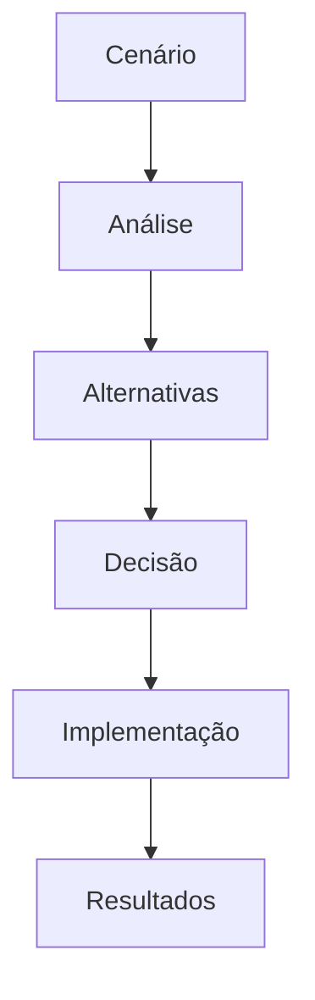

# 📊 Estudos de Caso

## 📝 Definição

Esta seção contém análises detalhadas de cenários reais de tomada de decisão em plataformas de dados, incluindo modernização, otimização e priorização.

## 🔄 Como Funciona

## 📊 Tipos de Casos

### 🔄 Modernização de Plataforma
- Migração Redshift para Snowflake
- Adoção de Delta Lake
- Implementação de dbt

### 💰 Otimização de Custos
- Análise de uso de recursos
- Estratégias de cache
- Dimensionamento de clusters

### 📋 Priorização
- Framework RICE para dados
- Balanceamento entre times
- Gestão de stakeholders

### 🚨 Gestão de Incidentes
- Postmortems
- Planos de mitigação
- Melhorias de processos

## 🔗 Recursos Principais

- [Templates de Análise](./templates/README.md)
- [Framework de Decisão](./framework/README.md)
- [Métricas de Sucesso](./metrics/README.md)