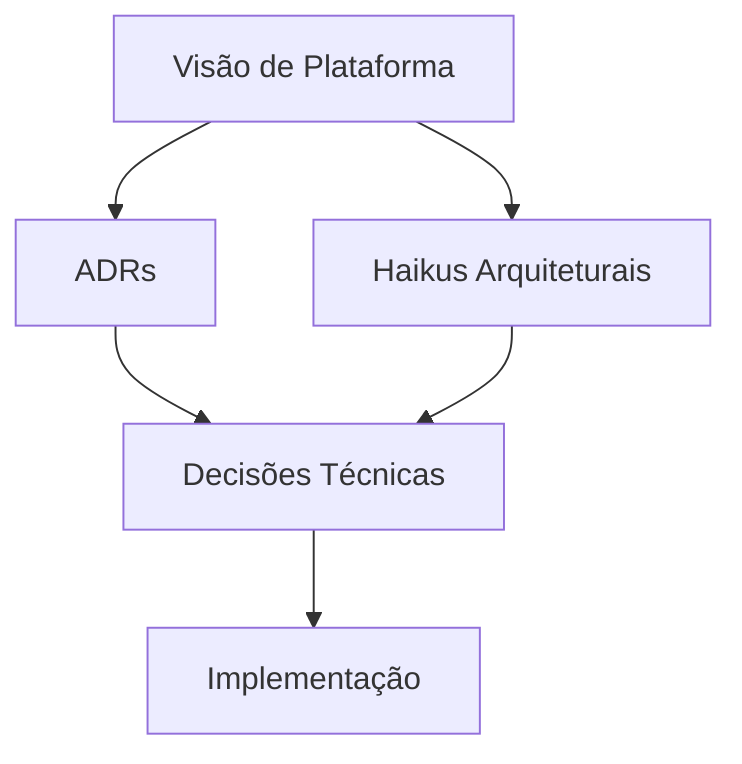

# 🏗️ Arquitetura de Dados

## 📝 Definição

Esta seção contém a documentação estratégica da plataforma de dados, incluindo decisões arquiteturais, visão técnica e frameworks de decisão.

## 🔄 Como Funciona

## 📊 Tipos Principais

### 📑 ADRs (Architecture Decision Records)
Documentação das decisões arquiteturais significativas tomadas no projeto, incluindo contexto, consequências e status.

### 📜 Haikus Arquiteturais
Representações concisas e poéticas de conceitos arquiteturais complexos, facilitando a comunicação e memorização.

### 🎯 Frameworks de Decisão
Guias estruturados para tomada de decisão em diferentes contextos da plataforma de dados.

## 🔗 Casos de Uso

- [ADRs](./adr/README.md) - Registro de decisões arquiteturais
- [Haikus](./architecture-haikus/README.md) - Haikus arquiteturais
- [Visão de Plataforma](./platform-vision.md) - Documento de visão técnica 