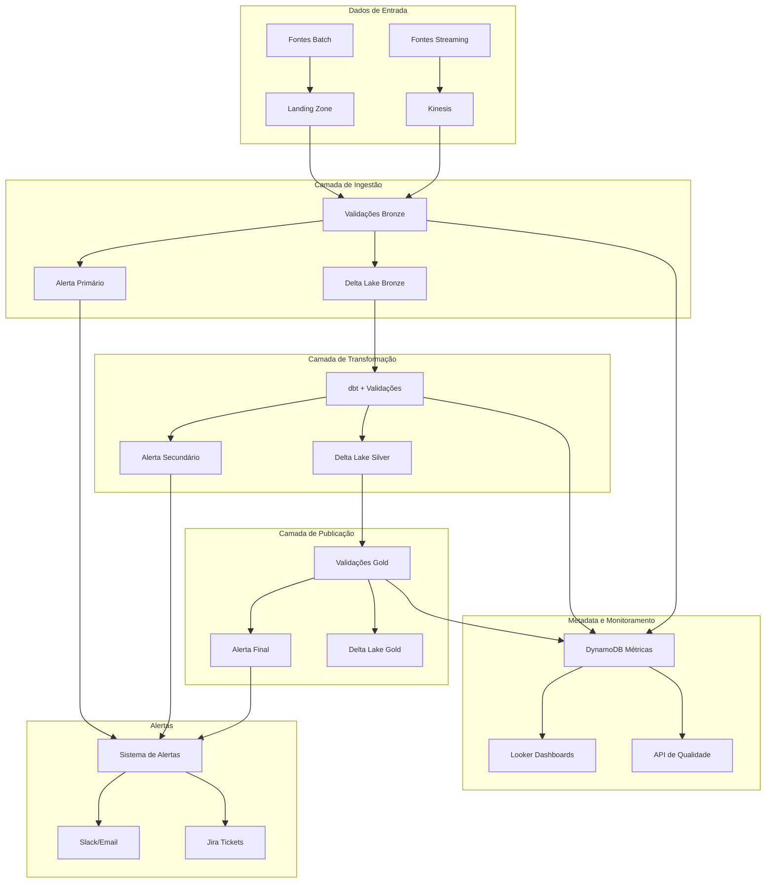

# Architecture Haiku: Plataforma de Monitoramento de Qualidade de Dados

## Sistema
Plataforma centralizada para monitoramento, validação e alertas de qualidade de dados em tempo real e batch, integrada com pipelines existentes para garantir confiabilidade e consistência dos dados utilizados em decisões críticas de negócio.

## Objetivos de Negócio
- Acelerar a tomada de decisões com dados confiáveis e validados
- Democratizar a visibilidade de métricas de qualidade para times técnicos e de negócios
- Reduzir incidentes causados por problemas de qualidade de dados em 70%
- Permitir rastreabilidade e accountability de qualidade entre times produtores e consumidores
- Estabelecer SLAs objetivos para datasets críticos para o negócio

## Restrições
- Utilização exclusiva da stack tecnológica aprovada (AWS, Spark, Airflow)
- Budget anual fixo com revisão trimestral
- Implementação inicial em 3 meses com iterações incrementais
- Conformidade com políticas internas de segurança e acesso a dados
- Capacidade atual da equipe sem contratações adicionais

## Prioridade de Atributos
Confiabilidade > Observabilidade > Automação > Usabilidade > Escalabilidade > Performance

## Decisões de Design

### Arquitetura Geral
- Arquitetura em camadas seguindo modelo Medalhão (Bronze/Prata/Ouro)
- Implementação de validações automatizadas via dbt em pontos estratégicos dos pipelines
- Detecção de anomalias através de monitoramento estatístico usando Great Expectations
- Geração de metadata de qualidade armazenada em DynamoDB para consulta rápida
- Dashboards em Looker para visualização de SLAs por dataset crítico

### Componentes Principais
- **Camada de Coleta**: Instrumentação de pipelines existentes para captura de métricas
- **Camada de Processamento**: Cálculo de métricas e validação de regras em Spark
- **Camada de Armazenamento**: Métricas em DynamoDB e logs detalhados em S3
- **Camada de Alerta**: Integração com Slack/Email para notificações baseadas em severidade
- **Camada de Visualização**: Dashboards em Looker com APIs para embed em outras aplicações

### Fluxo de Dados
- Validações executadas em três momentos: ingestão (bronze), transformação (prata) e publicação (ouro)
- Métricas calculadas incrementalmente para minimizar reprocessamento
- Logs de qualidade armazenados com particionamento por data, domínio e criticidade

### Monitoramento e Alertas
- Sistema de alertas com três níveis de severidade baseados no impacto ao negócio
- Auto-healing para problemas comuns em datasets não-críticos
- Escalação automática para time responsável em caso de falhas em datasets críticos

### Governança
- Catálogo de validações com metadata de regras de negócio associadas
- Ownership claro de datasets e respectivas regras de qualidade
- Framework para definição colaborativa de métricas entre times técnicos e de negócio

### Extensibilidade
- APIs para integração com outras ferramentas do ecossistema
- Hooks para adição de validações customizadas por times de produtos
- Versão lite embedável em pipelines de ML e analytics

## Diagrama de Arquitetura (Alto Nível)

## Considerações Futuras
- Implementação de ML para detecção proativa de anomalias
- Extensão para validações semânticas e contextuais além das sintáticas
- Integração com ferramentas de lineage para rastreabilidade completa
- Desenvolvimento de assistente virtual para diagnóstico de problemas de qualidade
