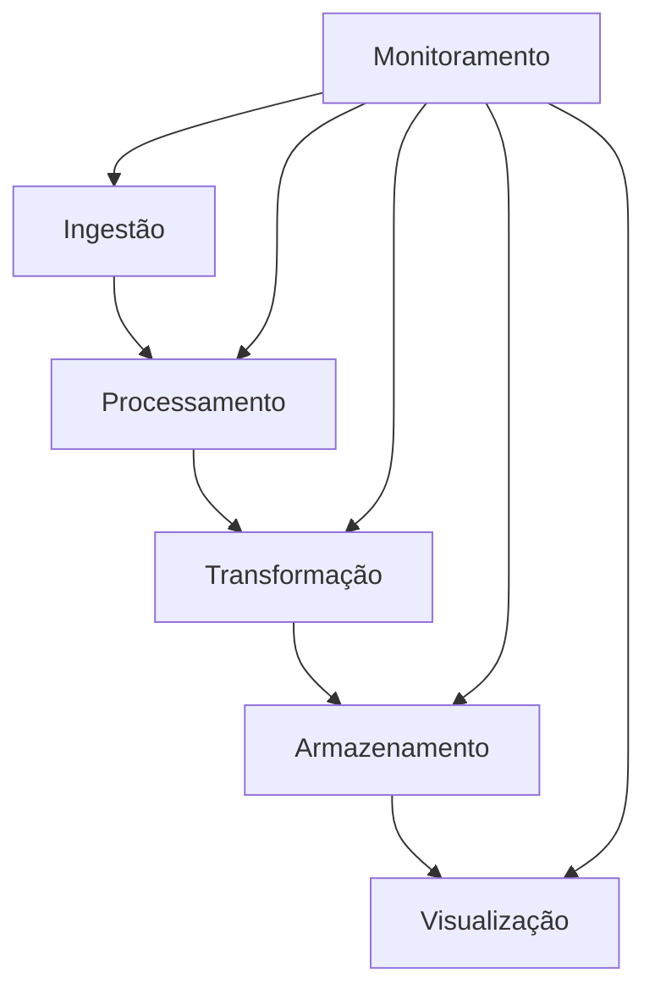

# 🚀 Projetos End-to-End

## 📝 Definição

Esta seção contém projetos completos que integram múltiplas tecnologias da Modern Data Stack em casos de uso reais, com documentação detalhada e diagramas.

## 🔄 Como Funciona

## 📊 Tipos de Projetos

### 📈 Analytics Engineering
- Pipeline completo com dbt
- Modelagem dimensional
- Testes e documentação

### 🔄 Data Engineering
- Ingestão com Airflow
- Processamento com Spark
- Armazenamento em Delta Lake

### 📊 Data Science
- Feature Engineering
- Modelagem preditiva
- Deployment de modelos

### 🔍 Monitoramento
- Métricas de qualidade
- Alertas e dashboards
- Observabilidade

## 🔗 Recursos Principais

- [Pipeline Analytics](./analytics-pipeline/README.md)
- [Pipeline Machine Learning](./ml-pipeline/README.md)
- [Pipeline Real-Time](./real-time-pipeline/README.md)