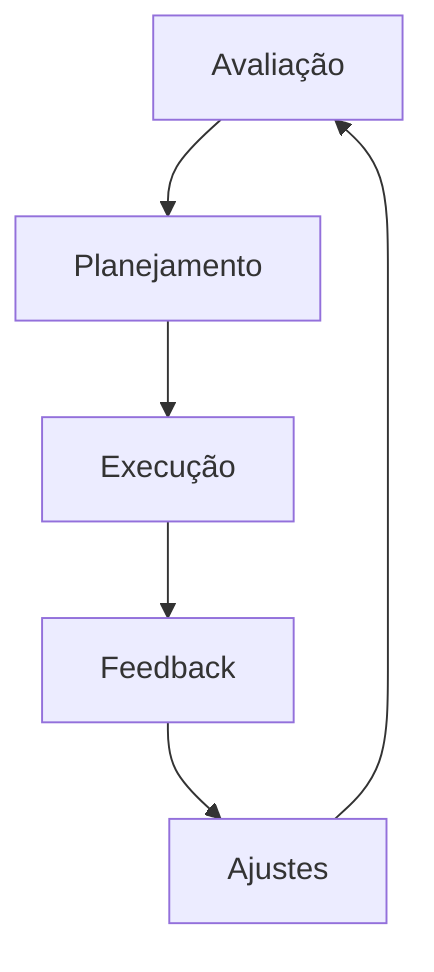

# 👥 Laboratório de Liderança

## 📝 Definição

Esta seção contém recursos e templates para desenvolvimento de habilidades de liderança em equipes de dados, incluindo one-on-ones, feedback e desenvolvimento de equipe.

## 🔄 Como Funciona

## 📊 Áreas de Desenvolvimento

### 👤 One-on-Ones
- Templates de reunião
- Guia de perguntas
- Acompanhamento de ações

### 📈 Desenvolvimento de Equipe
- Planos individuais
- Matriz de habilidades
- Objetivos e métricas

### 💬 Feedback
- Framework Radical Candor
- Feedback situacional
- Documentação e follow-up

### 🎯 Gestão de Performance
- OKRs para dados
- Avaliações técnicas
- Planos de carreira

## 🔗 Recursos Principais

- [Templates de One-on-One](./one-on-ones/README.md)
- [Framework de Feedback](./feedback/README.md)
- [Planos de Desenvolvimento](./development/README.md) 