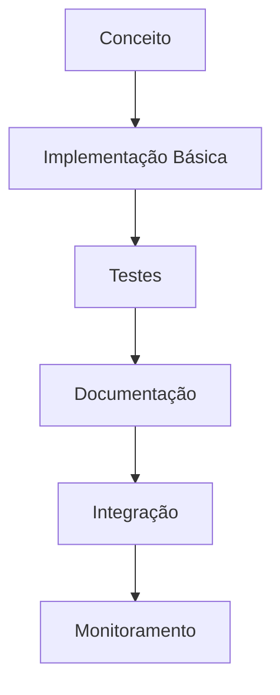

# 🔄 Projetos Práticos

## 📝 Definição

Esta seção contém implementações práticas de tecnologias específicas da Modern Data Stack, com foco em Airflow, dbt, Spark e monitoramento.

## 🔄 Como Funciona

## 📊 Tipos de Projetos

### 🌪️ Apache Airflow
- [Fundamentos do Airflow](./airflow-fundamentals/README.md)
- Padrões de DAGs
- Monitoramento e Observabilidade

### 🔧 dbt (data build tool)
- [Fundamentos do dbt](./dbt-fundamentals/README.md)
- Modelagem Dimensional
- Testes e Documentação

### ⚡ Apache Spark
- [Fundamentos do Spark](./spark-fundamentals/README.md)
- Otimização de Jobs
- Integração com Delta Lake

### 🔄 Projetos Integrados
- [Pipeline End-to-End](./end-to-end-pipeline/README.md)
- [dbt + Airflow: Análise de Voos](./dbt-airflow-flights/README.md)

## 🔗 Recursos Principais

- [Documentação do Airflow](https://airflow.apache.org/docs/)
- [Documentação do dbt](https://docs.getdbt.com/)
- [Documentação do Spark](https://spark.apache.org/docs/latest/)